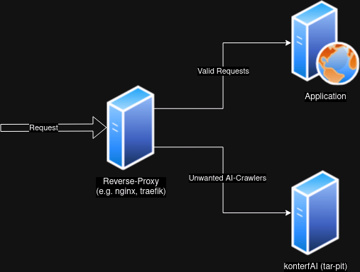

[](https://app.element.io/#/room/#konterfAI:matrix.org)
[](LICENSE)

# konterfAI

(c) 2024 konterfAI

konterfAI is an attempt to create a model-poisoner for LLM (Large Language Models) to generate bullshit-content to degenerate these models.
It is work in progress and not yet ready for production. It uses the concept fight-fire with fire. The backend queries a tiny
LLM running in [ollama](https://ollama.com/) with a high ai-temperature setting to generate hallucinatory content.

**NOTE:** konterfAI is not an offensive hacking tool, it is a countermeasure to fight back against AI-Crawlers,
that ignore robots.txt and other rules.

## License

konterfAI is licensed under the AGPL (GNU AFFERO GENERAL PUBLIC LICENSE). See [LICENSE](LICENSE) for the full license text.

## Get in touch

Join the [Matrix-Chat](https://app.element.io/#/room/#konterfai:matrix.org) to get in touch.

## Contributing

see [CONTRIBUTING](docs/contributing.md).

## FAQ (Frequently Asked Questions)

see [FAQ](docs/faq.md).

## How does it work?

konterfAI is supposed to run behind an reverse-proxy, like nginx or traefik.
The reverse proxy needs the ability to detect the user-agent of the incoming request and filter it by a given list.
If there is a match the crawler will not be presented with the original content, but with the poisoned content.
The poisoned content is also cluttered with randomized self-references to catch the crawlers in some kind of tar-pit.



**Note:** Those are examples and not intended for copy & paste usage. Make sure to read them carefully and adjust them to your needs.

## What ollama models does konterfAI ship?

None, konterfAI does not ship any models. A default model will be downloaded upon ollama start.
If you want to use a different model, you can pick one from the [ollama-models](https://ollama.com/models) page and
adapt your configuration accordingly.

## Building

```bash
$> make build
```

For a full list of build targets see [Makefile](Makefile).

## How to run it?

### Production deployment

If you are really brave and want to try konterfAI in a production environment, see there are two examples for
[nginx](deployments/nginx) and [traefik](deployments/traefik) in the deployment-folder.

**Note:** These examples are not intended for copy & paste usage.
Make sure to read them carefully and adjust them to your needs.

**WARNING:** IMPROPER CONFIGURATION WILL HAVE NEGATIVE EFFECTS ON YOUR SEO

### Development

**Note:** `-gpu` is optional, if you do not have a ollama-capable GPU, you can omit it.

```bash
$> make start-ollama[-gpu]
$> make run
```

### Docker

**Start:**

```bash
$> make start-ollama[-gpu]
$> make docker-build
$> make docker-run
```

**Stop:**

```bash
$> make docker-stop
```

### Docker-Compose

**Start:**

```bash
$> make docker-compose-up
```

**Stop:**

```bash
$> make docker-compose-down
```

For more complex examples edit [docker-compose.yml](docker-compose-dev.yml) to suit your needs.

## Configuration

konterfAI is configured via cli-flags. For a full list of supported flags run (after [building](#building)):

```bash
$> ./bin/konterfai --help
```

The docker-image is configured via environment-variables. 
For a full list of supported variables see [docker-compose.yml](docker-compose-dev.yml) and [entrypoint.sh](entrypoint.sh).